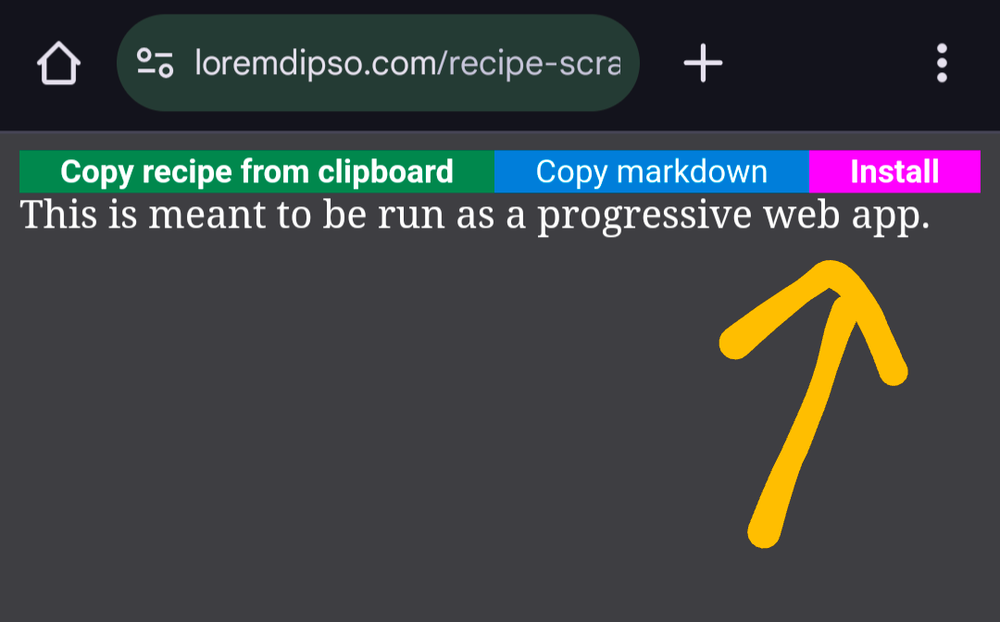
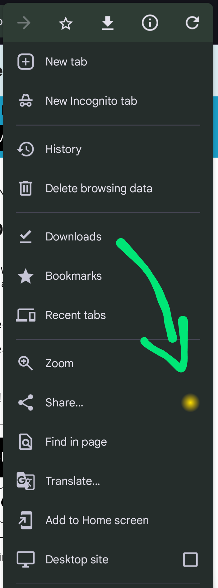
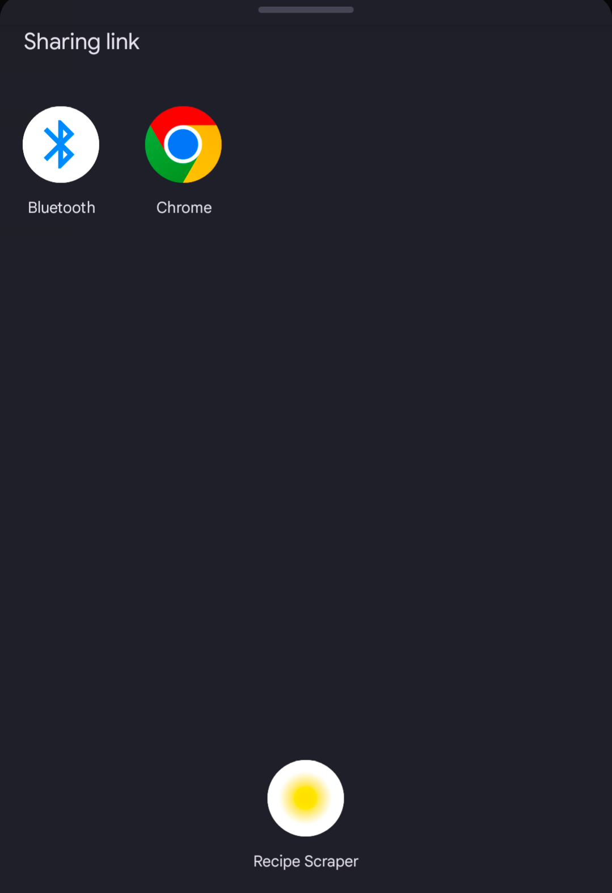

# RecipEase

Simple [PWA](https://developer.mozilla.org/en-US/docs/Web/Progressive_web_apps) that you can install on phone or desktop. Attempts to grab only the essential portions of a recipe for your convenience. Supports exporting to Markdown. This doesn't need an account and doesn't store any information about you.

See it live at <https://loremdipso.com/recipease>

Or watch the demo video at <https://www.youtube.com/shorts/6HIx44AcGeQ>.

## Installation

If you see an "Install" button then click on it. If not then you can't install, sorry :/

<!--  -->

## Usage

You can copy the recipe's URL to your clipboard and then use the "Copy recipe from clipboard" button, but if you've installed this app then you can simply share the recipe website with it.

<!--  -->
<!--  -->
